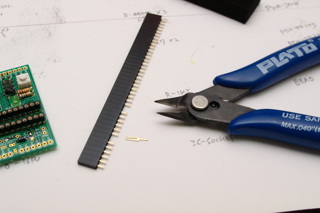
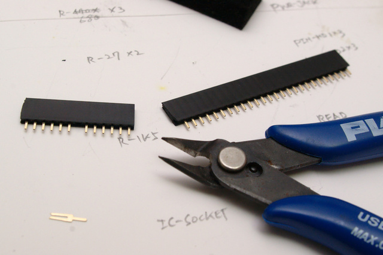
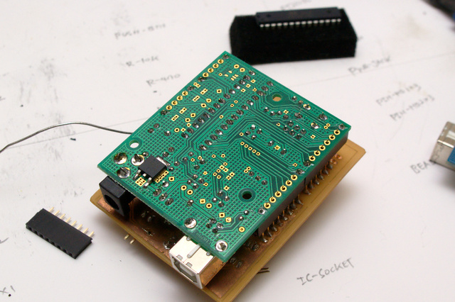

## HUMA 조립 설명서

의무교육 과정에서 납땜을 배운 적 있다면, 
[만화로 배우는 납땜](http://web.suapapa.net:8080/wordpress/?p=460)

> 경고: 본인의 안전은 스스로의 책임입니다.

### 도구

HUMA PCB와 [부품 목록](`part_list.md`)을 참고해 부품들을 준비합니다.

### 땜질하기

높이가 낮은 부품에서 높은 부품 순으로, 보드의 안쪽에서 바깥으로, 열에 강한 부품부터 약한 부품 순으로 때웁니다.

우선 높이가 낮은 3.3V 전원 용 SMD 커패시터를 때워 보겠습니다. SMD 커패시터는 + 방향에 띄로 표시가 되어 있습니다. 

2.2u 글자 방향에 띄가 오도록 자리를 잡은 뒤, 한 쪽을 먼저 때워 고정하고,

> 참고: 보드에는 2.2u 로 표시되어 있지만, 10uF 커패시터를 사용했습니다.

나머지 접점을 마저 때우면 됩니다. 커패시터 옆의 솔더 점퍼에 납을 올려 USB와 3V3을 연결합니다. 이러면 USB 칩(FT232BL)이 제공하는 3.3V를 사용하게 됩니다.

> 참고: 3.3V에 전류가 많이 필요한 경우 HUMA 보드 뒷면에 MIC5219와 470pF 커패시터를 장착하고, 솔더 점퍼의 LDO 와 3V3을 연결하면, 5V전원에서 변환한 3.3V를 사용하게 할 수 있습니다.

USB2시리얼 칩인 FT232BL(또는 FT232BM)을 때웁니다. SMD IC를 때워 본 경험이 없다면 [SMD 납땜하기](http://web.suapapa.net:8080/wordpress/?p=481)를 참조하세요.

> 참고: 확대경등을 사용해 SMD 부품이 제대로 연결되었는지 재차 확인합니다. 다른 부품들을 장착한 후에는 잘못을 바로잡기 정말 힘들어 집니다.

보드에는 7개의 100nF이 쓰이며, SMD(1608)나 원형 디스크 모양의 세라믹 커패시터 중 선택적으로 장착할 수 있습니다. SMD 커패시터를 선택했으면 지금 때워 줍니다. 100nF 커패시터는 방향성이 없습니다.

이제 보드를 조립하는 과정에서 가장 어려운 부분이 끝났습니다.

보드에 쓰여진 값 대로의 저항들을 연결합니다. 1/4W 또는 1/8W 규격의 보통 저항(정밀도 5%)을 사용합니다. 높은 정밀도(1%)의 저항은 가격이 더 비싸지만, 이같은 디지털 회로에서는 특별한 장점이 없습니다. 1/2W 규격의 저항은 가격은 같지만 크기가 크기 때문에 장착하기 까다롭습니다.

> 참고: `*470`으로 표시된 세 개의 저항은 LED용 저항으로 꼭 470옴을 사용할 필요 없이 330옴 ~ 1K옴 사이의 아무 저항을 사용해도 됩니다. 제 경운 680옴이 많이 남아서 이를 사용했습니다.

전원 잭 옆의 다이오드, USB 커넥터 밑의 비드를 연결합니다. 비드 대신, 정품 아두이노 처럼, PTC1812 자리에 Resetable FUSE를 연결 할 수도 있습니다. 비드와 FUSE 둘 중 하나를 선택해서 장착합니다.

보드를 뒤집어 7805를 때웁니다. 한쪽 다리의 패드에 우선 납을 올려 자리를 잡고, 

자리가 잘 잡히면 나머지 패드들을 때워 줍니다.

레조에이터(파란 부품)와 크리스탈(은색)을 때웁니다.

> 참고: HUMA 보드에 레조에이터의 값이 오기되었습니다. 12M가 아니라 6MHz를 사용합니다.

> 참고: 사진의 크리스탈 밑의 22pF 커패시터들의 방향을 잘못 연결했네요. 90도 돌려 크리스탈과 같은 방향으로 연결합니다.

세 개의 3mm LED를 연결합니다. LED는 극성이 있는 부품으로 바른 방향으로 장착해야 합니다. 글자 (R/T, L, PWR) 쪽으로 짧을 다리 (또는 깍인 면)이 오게 장착합니다.

IC 소켓을 장착합니다. 이 사진에서는 필요한 만큼 잘라 쓰는 소켓을 사용했습니다. 제 위치에 바르게 때우기 위해 종이테이프와 핀헤더 소켓으로 고정한 뒤 납땜하였습니다.

> 참고: 종이테이트, 또는 마스킹 테이프, 는 금방 떼는 경우 끈적임이 남지 않기 때문에, 3 센티미터 정도 잘라 두면 보드를 조립하는 동안 두고두고 부품을 가 고정하는 용도로 유용하게 사용할 수 있습니다.

SMD 커패시터를 장착하지 않은 경우 100nF의 세라믹 커패시터 7개를 지금 장착합니다.

47uF~100uF 사이의 전해 (또는 고체) 커패시터를 장착합니다. SMD 형도 장착할 수 있게 패드를 준비해 두었습니다. 커패시터 몸통의 하얀 띠(-)가 사진처럼 보드의 커패시터 모양에서 평편한 곳을 향하게 장착합니다.

USB 커넥터, 전원 커넥터, 리셋 스위치, ISP 핀헤더 등을 때워 줍니다.

6핀, 8핀 핀헤더 소켓이 두개 씩 필요합니다. 긴 소켓을 구입한 경우 사진처럼 자를 부분의 핀을 니퍼로 잡다 당겨 빼고,

잘라서 대신 사용하면 됩니다.

실드가 있다면 핀헤더 소켓을 때우는기 조금 더 편하게 때울 수 있습니다. (없으면 테이프를 이용해 가 고정하면 됩니다.) 핀헤더의 양 끝 핀을 때워 고정한 뒤, 실드를 빼고 나머지 핀들도 마저 때웁니다.

납땜이 모두 끝났습니다. IC 소켓에 ATMEGA 칩을 끼웁니다.

전원 선택용 점퍼를 끼워 완성 합니다.

### 부트로더 굽기

아두이노 부트로더가 심어져 있는 ATMEGA칩을 산 게 아니라면 최초 한번 ISP를 사용해 아두이노 부트로더를 구워줘야 합니다. 
* [Arduino S3V3 bootloader](http://web.suapapa.net:8080/wordpress/?p=74)
* [Arduino 시작하기](http://tinysun.tistory.com/8) - 작은태양님

### Source
[프리두이노](http://www.freeduino.org)
[HUMA](https://github.com/suapapa/HUMA)

